# GitOps ArgoCD — Terraform Infrastructure

Provisions the AWS infrastructure for the GitOps + ArgoCD on EKS project.

## Architecture

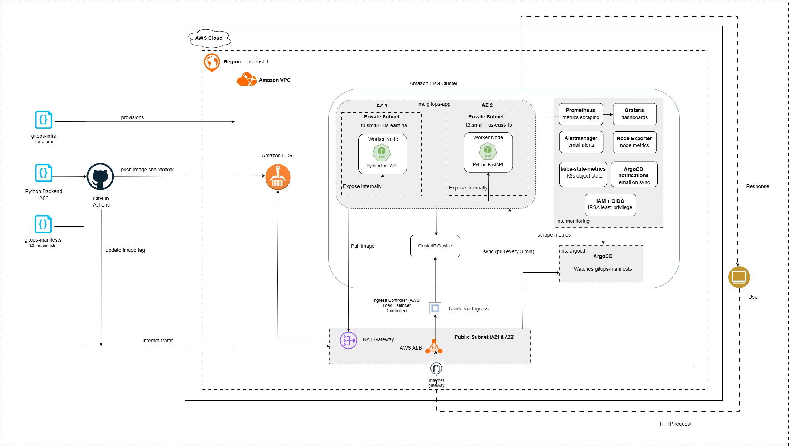


## What gets created

| Resource | Count | Notes |
|---|---|---|
| VPC | 1 | 10.0.0.0/16 |
| Public subnets | 2 | One per AZ — ALB and NAT live here |
| Private subnets | 2 | One per AZ — EKS nodes live here |
| Internet Gateway | 1 | |
| NAT Gateways | 2 | One per AZ for HA egress |
| Elastic IPs | 2 | For NAT Gateways |
| Route tables | 3 | 1 public + 2 private |
| EKS cluster | 1 | v1.33, private+public endpoint |
| Managed node group | 1 | 2× t3.small across 2 AZs |
| OIDC provider | 1 | Enables IRSA for ALB controller |
| IAM cluster role | 1 | For EKS control plane |
| IAM node role | 1 | For worker nodes (ECR pull, CNI) |
| ECR repository | 1 | With image scan on push |
| Security groups | 2 | Cluster + nodes |


## Prerequisites

```bash
# Verify versions
terraform -version    # >= 1.6.0
aws --version         # >= 2.x
kubectl version --client

# Configure AWS credentials
aws configure
# or export AWS_ACCESS_KEY_ID / AWS_SECRET_ACCESS_KEY / AWS_DEFAULT_REGION
```

## Deploy

```bash
# 1. Clone / navigate to this directory
cd gitops-infra

# 2. Initialise providers and modules
terraform init

# 3. Preview the plan — review before applying
terraform plan

# 4. Apply (takes ~15 minutes)
terraform apply

# 5. Configure kubectl
aws eks update-kubeconfig --region us-east-1 --name gitops-argocd-dev-cluster

# 6. Verify nodes are Ready
kubectl get nodes
```

## After apply — next steps

### Install ArgoCD

```bash
kubectl create namespace argocd
kubectl apply -n argocd \
  -f https://raw.githubusercontent.com/argoproj/argo-cd/stable/manifests/install.yaml

# Wait for pods to be ready
kubectl wait --for=condition=available deployment \
  -l app.kubernetes.io/name=argocd-server \
  -n argocd --timeout=120s

# Get the initial admin password
kubectl get secret argocd-initial-admin-secret \
  -n argocd -o jsonpath="{.data.password}" | base64 -d && echo

# Port-forward the UI (open http://localhost:8080 in your browser)
kubectl port-forward svc/argocd-server -n argocd 8080:443
```

### Install AWS Load Balancer Controller (via Helm)

The controller provisions ALBs from Kubernetes Ingress resources.

```bash
# Add the Helm repo
helm repo add eks https://aws.github.io/eks-charts
helm repo update

# Get your account ID and OIDC URL from Terraform outputs
ACCOUNT_ID=$(aws sts get-caller-identity --query Account --output text)
OIDC_URL=$(terraform output -raw eks_oidc_provider_url)

# Create IAM policy for the controller
curl -o alb-iam-policy.json \
  https://raw.githubusercontent.com/kubernetes-sigs/aws-load-balancer-controller/main/docs/install/iam_policy.json

aws iam create-policy \
  --policy-name AWSLoadBalancerControllerIAMPolicy \
  --policy-document file://alb-iam-policy.json

# Create IAM service account (IRSA)
eksctl create iamserviceaccount \
  --cluster=gitops-argocd-dev-cluster \
  --namespace=kube-system \
  --name=aws-load-balancer-controller \
  --attach-policy-arn=arn:aws:iam::${ACCOUNT_ID}:policy/AWSLoadBalancerControllerIAMPolicy \
  --approve

# Install via Helm
helm install aws-load-balancer-controller eks/aws-load-balancer-controller \
  -n kube-system \
  --set clusterName=gitops-argocd-dev-cluster \
  --set serviceAccount.create=false \
  --set serviceAccount.name=aws-load-balancer-controller
```

### Push your first image to ECR

```bash
ECR_URL=$(terraform output -raw ecr_repository_url)
REGION=us-east-1

# Authenticate Docker to ECR
aws ecr get-login-password --region $REGION | \
  docker login --username AWS --password-stdin $ECR_URL

# Build and push
docker build -t $ECR_URL:v1.0.0 /path/to/your/app
docker push $ECR_URL:v1.0.0
```

## Destroy (clean up everything)

```bash
# Delete Kubernetes resources first to release the ALB and EBS volumes
# (Terraform can't delete the VPC if AWS-managed resources are still attached)
kubectl delete ingress --all -A
kubectl delete svc --all -A

# Then destroy all Terraform-managed resources
terraform destroy
```

## File structure

```
gitops-infra/
├── main.tf              # Root module — wires everything together
├── variables.tf         # All input variables with defaults
├── outputs.tf           # Useful values after apply
├── terraform.tfvars     # Your environment values (edit this)
├── backend.tf           # S3 remote state config (optional)
└── modules/
    ├── vpc/             # VPC, subnets, IGW, NAT, route tables
    ├── ecr/             # ECR repository + lifecycle policy
    ├── iam/             # Cluster role, node role
    └── eks/             # EKS cluster, node group, OIDC provider, SGs
```

---
## 📸 Screenshots
<p align="center">
    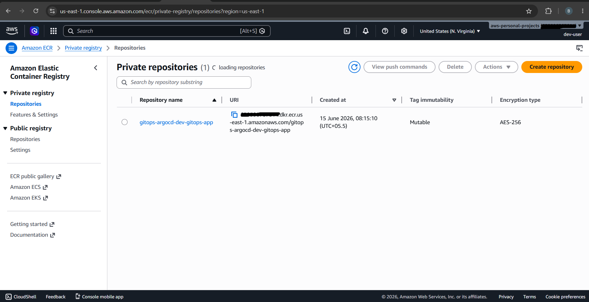
    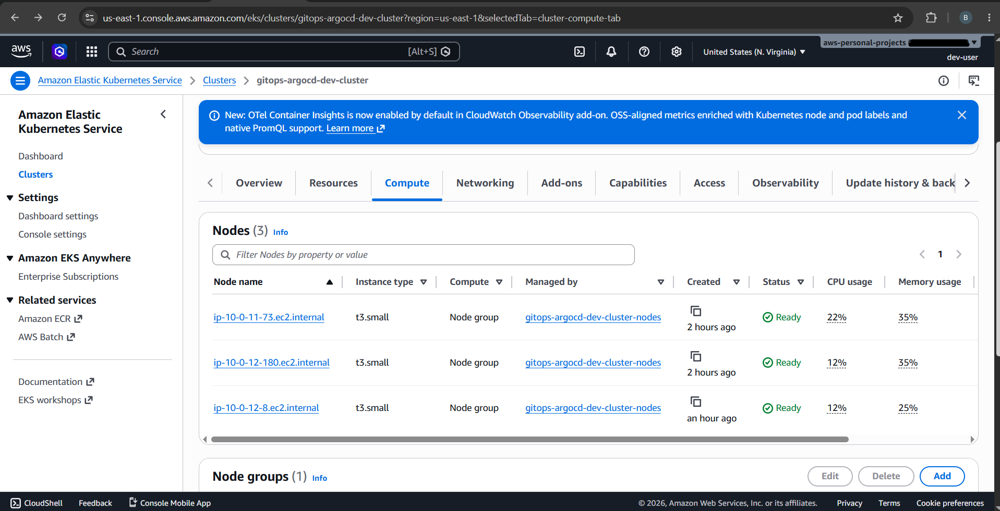
    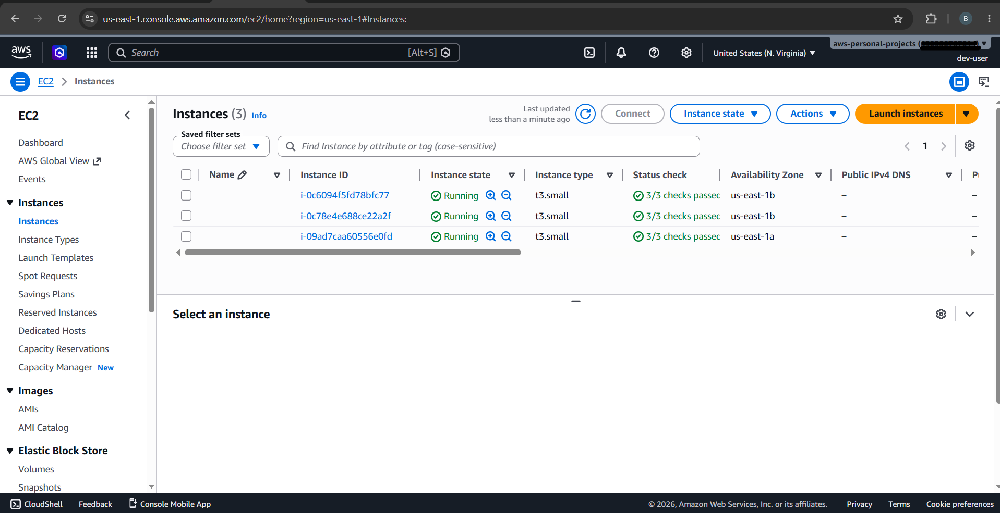
    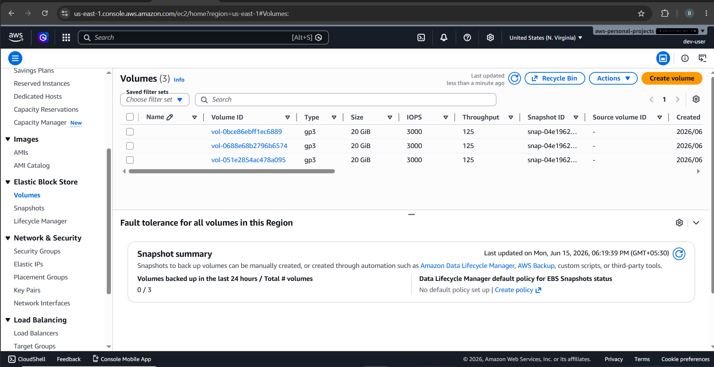
    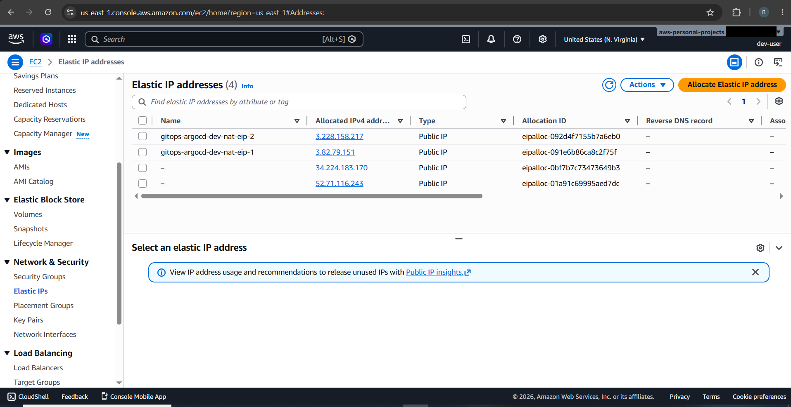
    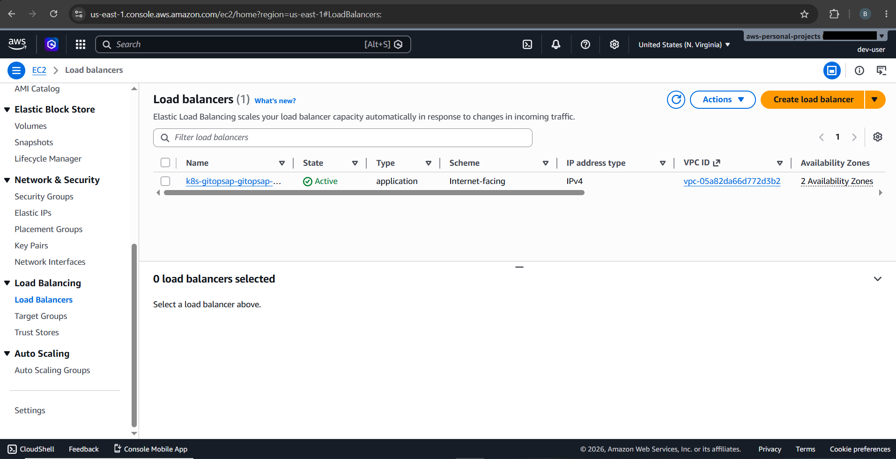
    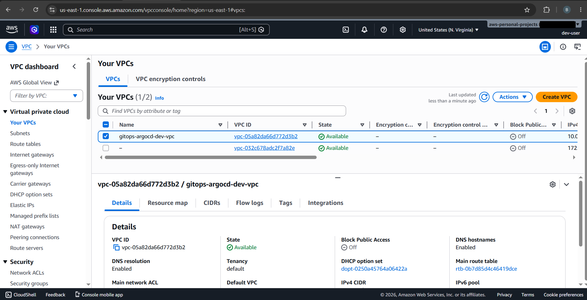
    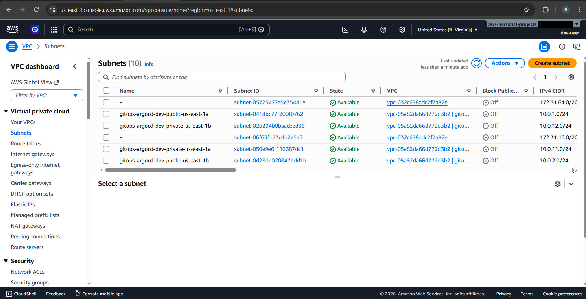
    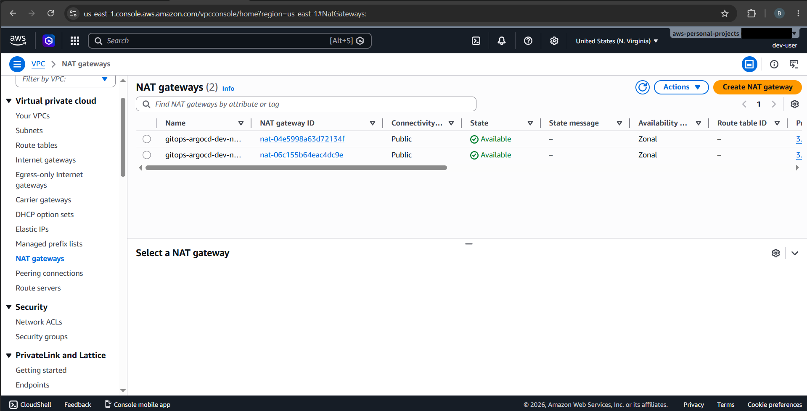
    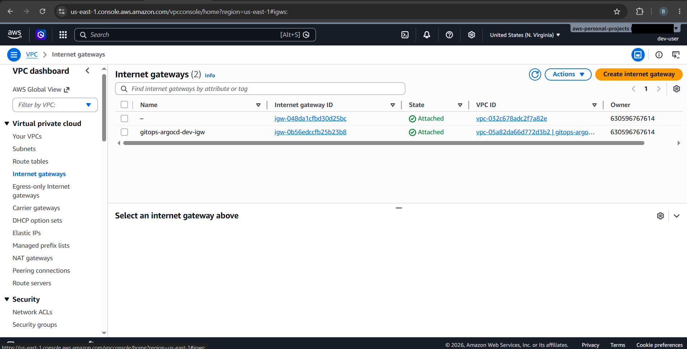
</p>

---

---
### Other related repositories
<p align="center">
  <a href="https://github.com/sasunmadhuranga/gitops-manifests">
    GitOps Manifests
  </a>
  <br />
  <a href="https://github.com/sasunmadhuranga/python-backend-app">
    Python Backend App
  </a>
</p>
---

## Author
Sasun Madhuranga

GitHub: https://github.com/sasunmadhuranga
